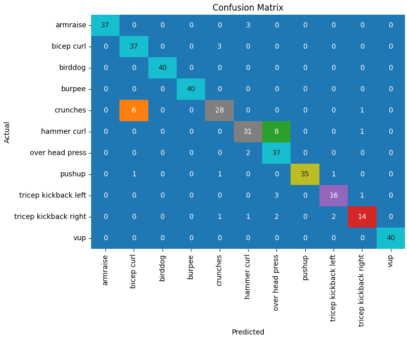
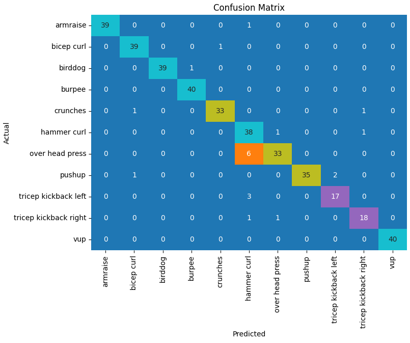
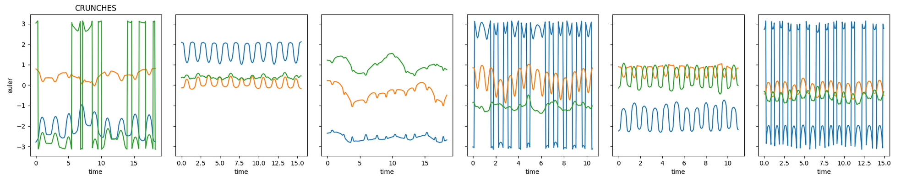
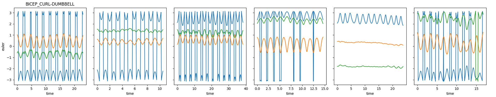

# Exercise Recognition

- [Introduction](#introduction)
- [Project Structure](#project-structure)
- [Notebooks](#notebooks)
- [Results](#results)
- [Contributing](#contributing)
- [Acknowledgments](#acknowledgments)

## Introduction

This project focuses on devoping models for predicting specific exercises and movements based off of data readings from an Inertial Measurement Unit (IMU) contained in a wearable device. IMU sensors capture information about acceleration, angular velocity, and sometimes magnetic fields, providing valuable insights into the motion and orientation of the device.

## Project Structure

**Data Links:**  

Data can be retrieved from [infinity.ai](https://infinity.ai).
- The specific dataset used for this project can be found here: [IMU Fitness Basic Dataset](https://marketplace.infinity.ai/products/imu-fitness-basic-dataset)
- The data contains 2000 sets of measurements each containing several repetitions of one of 10 different exercises. (within this project the tricep kickbacks were treated as 2 separate exercises Right and Left making a total of 11 exercises)

**Folders:**
- data: 
    - Contains a pickle folder and csv folder each containing .pkl or .csv files respectively throughout certain stages of processing.
    - there are zip files within these folders that need to be extracted within their folders prior to utilizing.
- notebooks: 
    - Jupyter notebook files mapping out the process followed throughout this project. See the [Notebooks](#notebooks) links below for further details.
- models: 
    - Contains several folders with the best initialization weight for each model.
    - also contains a folder 'my_tuning_dir' with the hyperparameters used for the hyperparameter tuning trials.
- images:
    - screen shots used for README.md
- README.md: 
    - Project documentation.

## Notebooks

**[motion_prediction_EDA](/notebooks/motion_prediction_EDA.ipynb)**: 
- Implements techniques for exploring, cleaning, processing, and transforming raw IMU data into a format suitable for predictive modelling.

**[initial_modelling_all_reps](/notebooks/initial_modelling_all_reps.ipynb)**: 
- Creation of models based on datasets using values from multiple exercise repetitions to predict specific exercises.
- use of RandomForestClassifier, Support Vector Machine and XGBoost Classifier

**[modelling_no_parameters](/notebooks/modelling_no_parameters.ipynb)**: 
- Building upon the previous notebook, this one explores models without including the parameter values used to obtain the IMU readings.
- use of RandomForestClassifier and XGBoost Classifier

**[modelling_by_rep](/notebooks/modelling_by_rep.ipynb)**: 
- Breaks down the original data sets into sequences representing one iteration of an exercise. 
- Models are created to assess if there is enough representation for accurate predictions of the exercises.
- Sequential neural network with Keras  

## Results

Without going through all of the challenges of figuring out how to process this data for modelling, I can easily separate this project into two parts. 

### Part 1

For the first part of this project, I converted the rotational matrices into Euler values to reduce the amount of values I needed to work with, and then took an even amount of rows from each exercise set and arranged them into a single row of data to plug into the models. So each exercise set was a single row containing most of the parameters used for creating the measurements and a set number of measurements throughout the sequence of repetitions of the exercises.

The models I used for this portion of the project are the RandomForest Classifier, Support Vector Machine (SVM) and XGBoost Classifier and the accuracy results I obtained are as follows.

    - RandomForest 91%
    - Support Vector Machine 88%
    - XGBoost 95%

At this point I was curious if the models would be able to differentiate the exercises without the use of the parameter values. So I removed those and ran the models again. I didn't run the SVM model again as it was clearly not keeping up with the other two.

    - RandomForest 91%
    - XGBoost 92%

Images above are RandomForest Confusion Matrix, SVM Confusion Matrix and XGBoost Confusion Matrix, in that order.

 
One thing that I found interesting while I was working through this project was taking a look at which exercises were being predicted incorrectly most often and which exercises they were being labelled as. For example in the above confusion matrices you can see that for the RandomForest and SVM models, crunches were being mislabelled as bicep curls. When you graph the Euler angles for each of the exercises, there are clearly many differences. These differences can be attributed to things such as, which arm the watch is being worn on, the orientation of the watch, or if the watch is starting to slide around the side of the wrist. That being said, if you compare the graphs for a sample of the exercise that is being mislabelled to the exercise it is being mislabelled for, you can also see many similarities and it is easy to see why there might be some confusion. See plots below. 

 

  

  

### Part 2 

For the second part of my project I started to look into whether a model could predict the exercises based on only one repetition of the movement. I decided to use a sequential neural network with an LSTM layer to try to accomplish this. After more hour than I can count, playing with parameters and different layers, I managed to come up with a model capable of predicting the exercises with accuracy in the high 90s. 

### Moving Forward

There are still some things that I am hoping to explore with this data set and prediction goal when I have more time to let some of these models run a bit longer.

## Contributing

Contributions are welcome! Feel free to open issues, submit pull requests, or provide feedback.

## Acknowledgments

Special thanks to Brian Lynch for your support and mentoring throughout this process.